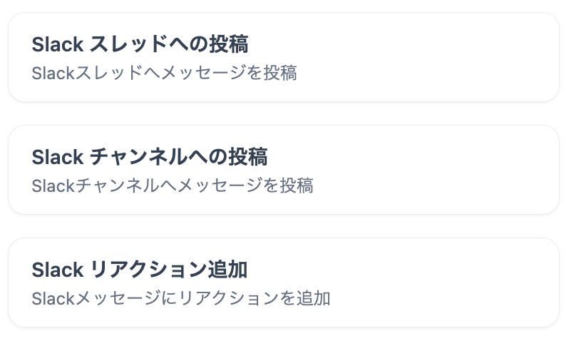
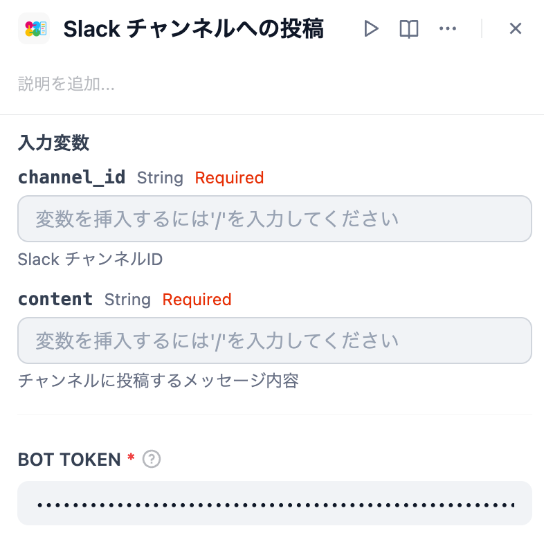
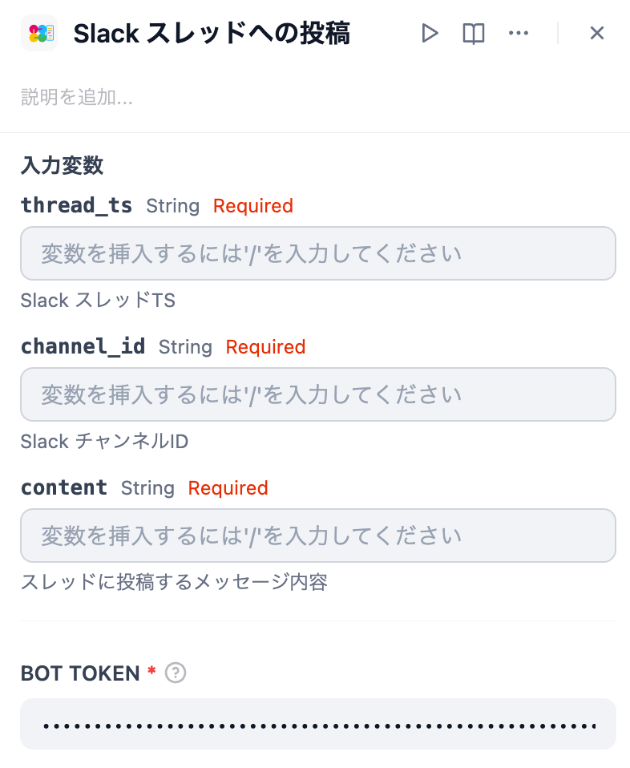
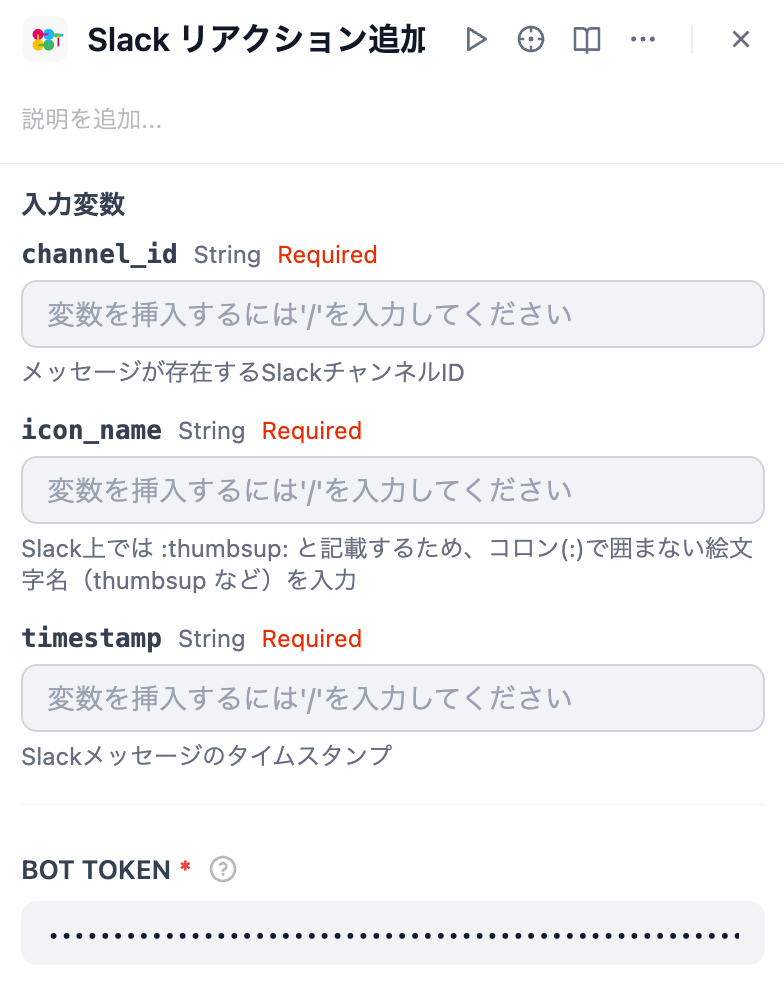

*他の言語で読む: [English](https://github.com/solaoi/dify-plugin-slack-post/blob/v0.0.2/README.md), [简体中文](https://github.com/solaoi/dify-plugin-slack-post/blob/v0.0.2/README.zh-Hans.md), [Português](https://github.com/solaoi/dify-plugin-slack-post/blob/v0.0.2/README.pt_BR.md).*


## Slack Post


**Author:** solaoi
**Version:** 0.0.2
**Type:** 道具

### 解説

チャンネルやスレッドへのメッセージ投稿を行う、mrkdwn形式の表示に対応したSlackツールプラグイン。

<div align="left">
  
</div>

#### 機能

- スレッド内でのメッセージ投稿
- チャンネルへのメッセージ投稿
- Slack 上での `mrkdwn` フォーマットに対応
- メッセージにリアクションを追加

#### 1. インストール方法

「プラグインをインストールする」画面で、以下のGitHubリポジトリを指定してインストールしてください。

https://github.com/solaoi/dify-plugin-slack-post

#### 2. 設定手順

##### 2-1. 公式のSlackBotプラグインと同様の手順でBot Tokenを作成します。

##### 2-2. 本プラグインの利用には、以下のスコープが必要です。

```text
chat:write, reactions:write
```

##### 2-3. 公式のSlackBotプラグインのセットアップ手順については以下をご参照ください。

https://github.com/langgenius/dify-official-plugins/blob/main/extensions/slack_bot/README.md

#### 3. 使い方

##### 3.1. Slackチャンネルへの投稿

<div align="left">
  
</div>

| 入力変数 | 説明 |
| ---- | ---- |
| channel_id | Slack チャンネルID |
| content | チャンネルに投稿するメッセージ内容 |

##### 3.2. Slackスレッドへの投稿

<div align="left">
  
</div>

| 入力変数 | 説明 |
| ---- | ---- |
| thread_ts | Slack スレッドTS |
| channel_id | Slack チャンネルID |
| content | スレッドに投稿するメッセージ内容 |

##### 3.3. Slackリアクション追加

<div align="left">
  
</div>

| 入力変数 | 説明 |
| ---- | ---- |
| channel_id | Slack チャンネルID |
| icon_name | 追加する絵文字の名前 |
| timestamp | Slackメッセージのタイムスタンプ |

#### 4. オプション

以下の拡張機能プラグインを併用すると、投稿先のパラメータ（チャンネルID及びスレッドTS）を簡単に取得できます。

- Slack Thread Bot  
https://marketplace.dify.ai/plugins/solaoi/slack-thread-bot
