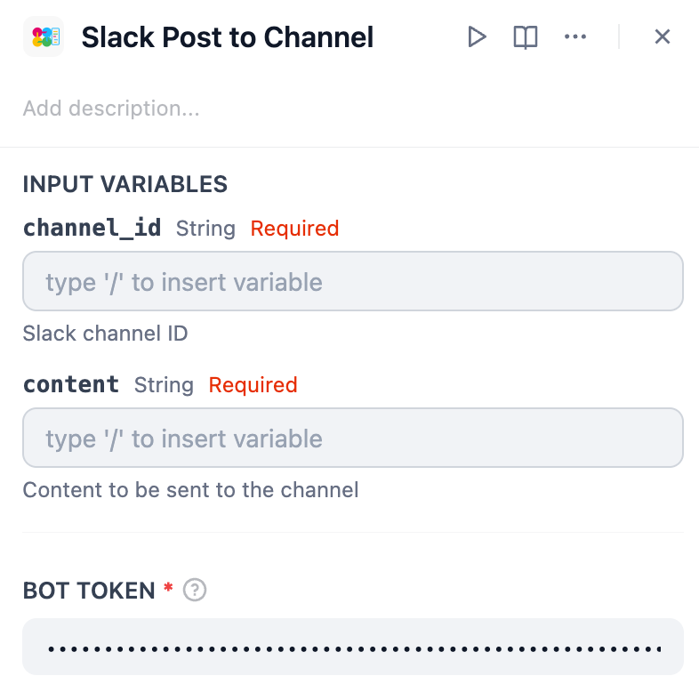
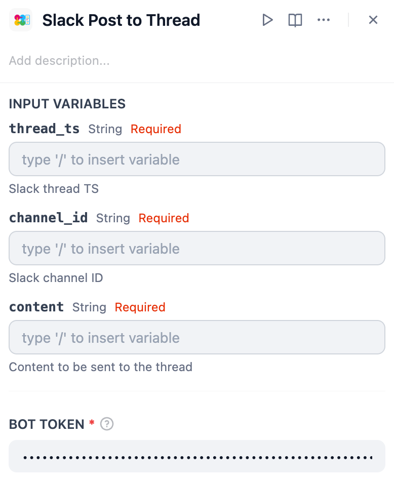

*Read this in other languages: [日本語](https://github.com/solaoi/dify-plugin-slack-post/blob/v0.0.1/README.ja.md), [简体中文](https://github.com/solaoi/dify-plugin-slack-post/blob/v0.0.1/README.zh-Hans.md), [Português](https://github.com/solaoi/dify-plugin-slack-post/blob/v0.0.1/README.pt_BR.md).*


## Slack Post


**Author:** solaoi
**Version:** 0.0.1
**Type:** tool

### Description

A Slack tool plugin for posting messages to channels or threads, with mrkdwn formatting.

<div align="left">
  
</div>

#### Features

- Post messages in a thread
- Post messages to a channel
- Supports Slack’s `mrkdwn` formatting

#### 1. Install

To install this plugin, specify the following GitHub repository when selecting "Install Plugin":

https://github.com/solaoi/dify-plugin-slack-post

#### 2. Setup

##### 2-1. Create a Bot Token using the same steps as the official SlackBot plugin.

##### 2-2. The following scopes are required for this plugin:

```text
chat:write
```

##### 2-3. For more details on setup the official SlackBot plugin, refer to:

https://github.com/langgenius/dify-official-plugins/blob/main/extensions/slack_bot/README.md

#### 3. How to use

##### 3.1. Slack Post to Channel

<div align="left">
  
</div>

| Input Variable | Description |
| ---- | ---- |
| channel_id | Slack channel ID |
| content | Content to be sent to the channel |

##### 3.2. Slack Post to Thread

<div align="left">
  
</div>

| Input Variable | Description |
| ---- | ---- |
| thread_ts | Slack thread TS |
| channel_id | Slack channel ID |
| content | Content to be sent to the thread |

#### 4. Optional

By using the following extension plugin, you can easily retrieve the parameters needed for posting (channel ID and thread TS):

- Slack Thread Bot  
https://marketplace.dify.ai/plugins/solaoi/slack-thread-bot
