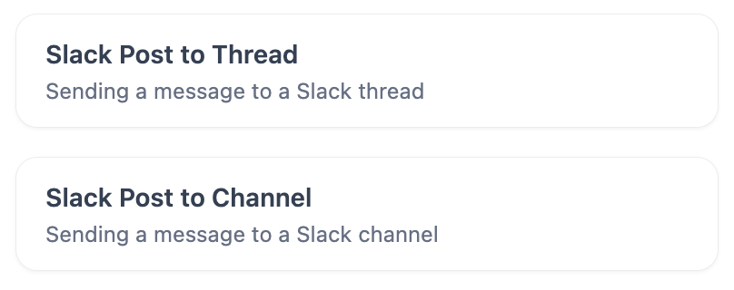
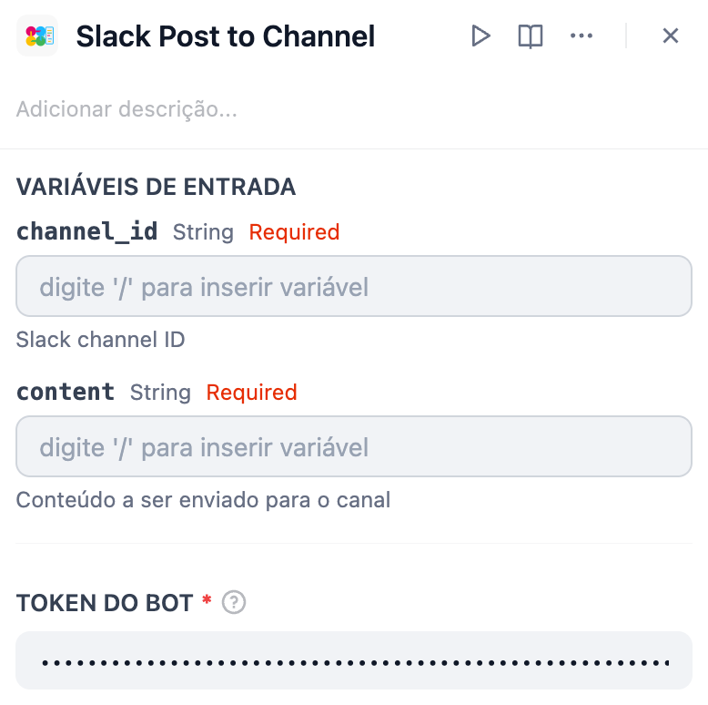
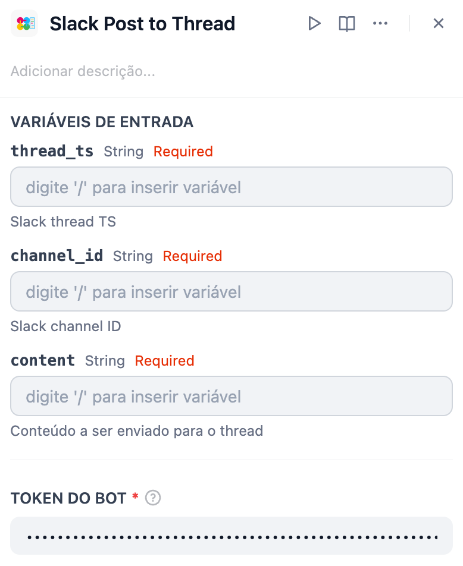

*Leia em outros idiomas: [English](https://github.com/solaoi/dify-plugin-slack-post/blob/v0.0.1/README.md), [日本語](https://github.com/solaoi/dify-plugin-slack-post/blob/v0.0.1/README.ja.md), [简体中文](https://github.com/solaoi/dify-plugin-slack-post/blob/v0.0.1/README.zh-Hans.md).*


## Slack Post


**Author:** solaoi
**Version:** 0.0.1
**Type:** ferramenta

### Descrição

Um plugin de ferramenta do Slack para postar mensagens em canais ou threads, com suporte à formatação mrkdwn.

<div align="left">
  
</div>

#### Recursos

- Enviar mensagens em uma thread  
- Enviar mensagens em um canal  
- Suporta o formato `mrkdwn` do Slack

#### 1. Instalação

Para instalar este plugin, ao selecionar "Instale o plugin", especifique o seguinte repositório do GitHub:

https://github.com/solaoi/dify-plugin-slack-post

#### 2. Configuração

##### 2-1. Crie um Bot Token seguindo as mesmas etapas do plugin oficial SlackBot.

##### 2-2. Este plugin requer os seguintes escopos:

```text
chat:write
```

##### 2-3. Para mais detalhes sobre a configuração do plugin oficial SlackBot, consulte:

https://github.com/langgenius/dify-official-plugins/blob/main/extensions/slack_bot/README.md

#### 3. Como usar

##### 3.1. Slack Post to Channel

<div align="left">
  
</div>

| Variável de entrada | Descrição |
| ---- | ---- |
| channel_id | Slack channel ID |
| content | Conteúdo a ser enviado para o canal |

##### 3.2. Slack Post to Thread

<div align="left">
  
</div>

| Variável de entrada | Descrição |
| ---- | ---- |
| thread_ts | Slack thread TS |
| channel_id | Slack channel ID |
| content | Conteúdo a ser enviado para o thread |

#### 4. Optional

Ao usar o seguinte plugin de extensão, você pode obter facilmente os parâmetros necessários para o envio (ID do canal e TS da thread):

- Slack Thread Bot  
https://marketplace.dify.ai/plugins/solaoi/slack-thread-bot
