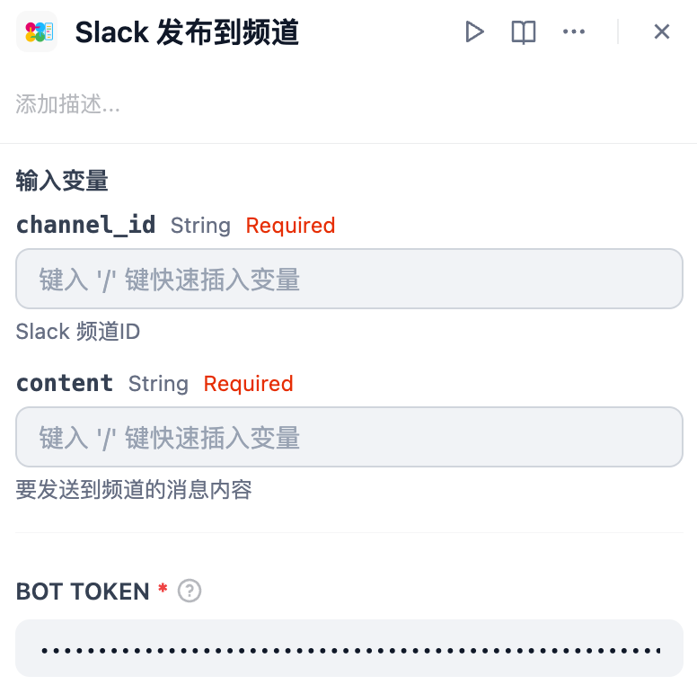
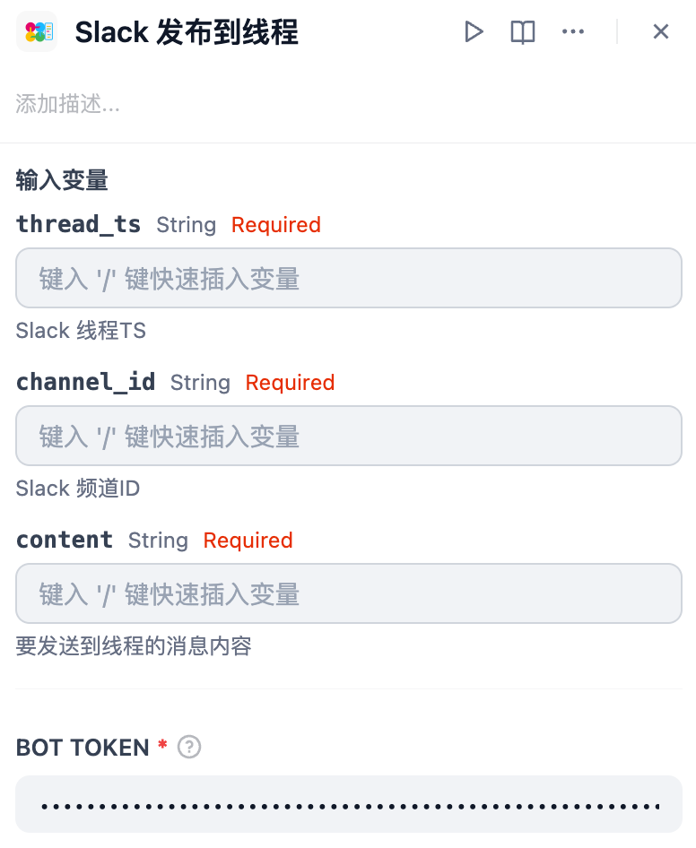

*以其他语言阅读：[English](https://github.com/solaoi/dify-plugin-slack-post/blob/v0.0.1/README.md)，[日本語](https://github.com/solaoi/dify-plugin-slack-post/blob/v0.0.1/README.ja.md)，[Português](https://github.com/solaoi/dify-plugin-slack-post/blob/v0.0.1/README.pt_BR.md)。*


## Slack Post


**Author:** solaoi
**Version:** 0.0.1
**Type:** 工具

### 描述

支持向频道或线程发送消息、并支持mrkdwn格式的Slack工具插件。

<div align="left">
  
</div>

#### 功能

- 在线程中发送消息  
- 在频道中发送消息  
- 支持Slack的 `mrkdwn` 格式

#### 1. 安装

要安装此插件，请在选择“安装插件”时指定以下 GitHub 仓库：

https://github.com/solaoi/dify-plugin-slack-post

#### 2. 设置

##### 2-1. 按照官方SlackBot插件的相同步骤创建Bot Token。

##### 2-2. 插件需要以下权限范围（Scopes）：

```text
chat:write
```

##### 2-3. 有关官方SlackBot插件的详细设置步骤，请参考：

https://github.com/langgenius/dify-official-plugins/blob/main/extensions/slack_bot/README.md

#### 3. 使用方法

##### 3.1. Slack 发布到频道

<div align="left">
  
</div>

| 输入变量 | 说明 |
| ---- | ---- |
| channel_id | Slack 频道ID |
| content | 要发送到频道的消息内容 |

##### 3.2. Slack 发布到线程

<div align="left">
  
</div>

| 输入变量 | 说明 |
| ---- | ---- |
| thread_ts | Slack 线程TS |
| channel_id | Slack 频道ID |
| content | 要发送到线程的消息内容 |

#### 4. 可选功能

通过以下扩展插件，可以轻松获取发送所需的参数（频道ID与线程TS）：

- Slack Thread Bot  
https://marketplace.dify.ai/plugins/solaoi/slack-thread-bot
